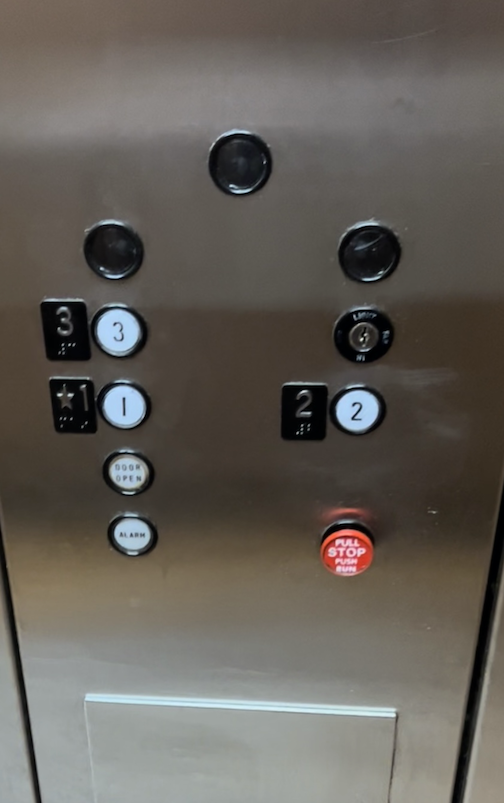
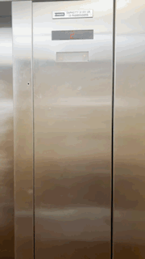
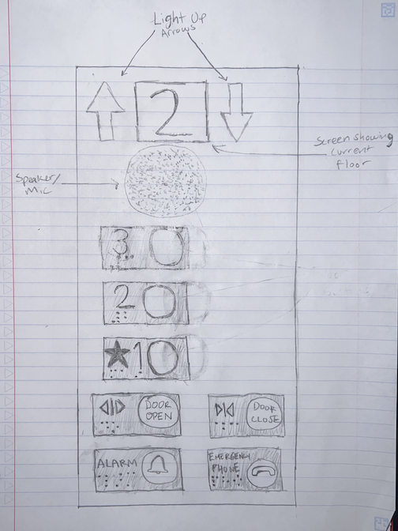

# p1.aidan.mullins

Link to github repository: https://github.com/aidanmullins/p1.aidan.mullins

# Part C
**Control Interface**

**Operation of Control Interface**

**Issues with Control Interface**

-	3rd floor button doesn’t light up 
-	Pointless buttons on top 
-	No close-door button
-	Screen that shows the current floor number is too high and difficult to read, especially for a shorter person
-	Not everyone should be able to stop and run the elevator whenever they want
-	Should have an emergency phone button
-	There is no sound that tells you what floor you’re on
-	There is no braille writing on the alarm or door open button

**Explanation**

-	The 3 pointless buttons, lack of sound notifying the user what floor they are on, as well as the lack of braille on the alarm and open-door buttons could confuse or potentially endanger the visually impaired users. 
-	The lack of a close-door button creates the potential for a user who is in a hurry to have to wait longer as well as if the door is not closing on its own then the user can not attempt to manually shut it.

# Part B
**Common Uses**

- To travel from one floor to another 
    - Current design has an awkward button set-up, and doesn't tell the user what floor they have arrived on except a small screen near the ceiling
- Open the door for another user approaching the elevator
    - Elevator has an open-door button to allow for this
- Close the door when in a hurry or if door is malfunctioning and not closing on its own 
    - Current design does not have a close-door button

**Rare Uses**

**Sequence of Actions**

1. Select the up or down button from the outside of the elevator
2. Enter the elevator
3. Click the desired floor to travel to
4. Goes to click the close-door button, but it isnt there
5. Exit the elevator once it has arrived on the destination floor

**How does the elevator support the user figure out how to make it work?**

The elevator lists the number of the floor next to and on the button for that floor. The floor number is also written in braille next to the button for visually impaired users. The user is expected to know to press that specific button to travel to the floor. The button

**How does the elevator provide feedback to the user?**

The button of the floor selected to travel to lights up (except for the 3rd floor). The screen above the controls near the ceiling displays what floor the elevator is currently on. The door of the elevator opens to let the user know that they can exit the elevator.

**Common Mistakes**

- It would be easy to bump the alarm on accident
- A child could pull on the stop elevator knob

**Improved Control Interface**

The new screen which will be lower to the ground and more visible to shorter or handicapped users and displays the current floor that the elevator is on. The arrows on either side of the screen will light up according to whether the elevator is travelling in the up or down direction. The speaker/microphone will verbally declare the floor that the elevator is arriving at which can make things easier for users to know what floor they are on, especially those that are visually impaired.

The floor buttons will provide feedback to the users by lighting up and are now arranged in a vertical order associated with their actual level in the hotel. 

I have added a close-door button for users who are in a hurry or for times when the elevator may be malfunctioning or slow to close. I have added an alarm button that is further away from the 1st floor button and therfore less likely to be pressed on accident. An emergency phone button has been added so that users can communicate with responders in case of emergency through the speaker/microphone. All of the buttons listed now have braille next to them to cater towards blind users.

# Part A
**Touchscreen Design Implementation Prototype**

**Gif of Interface**

